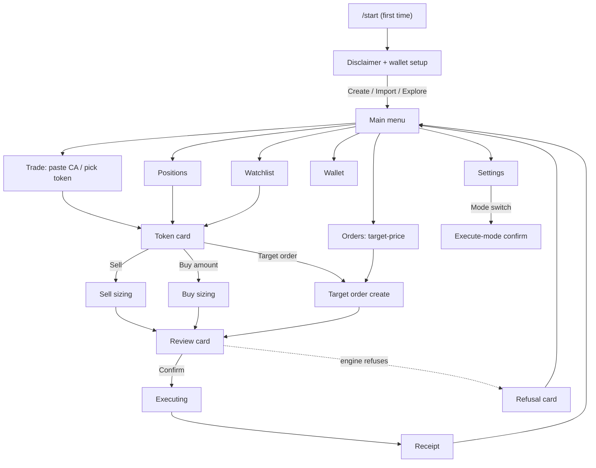
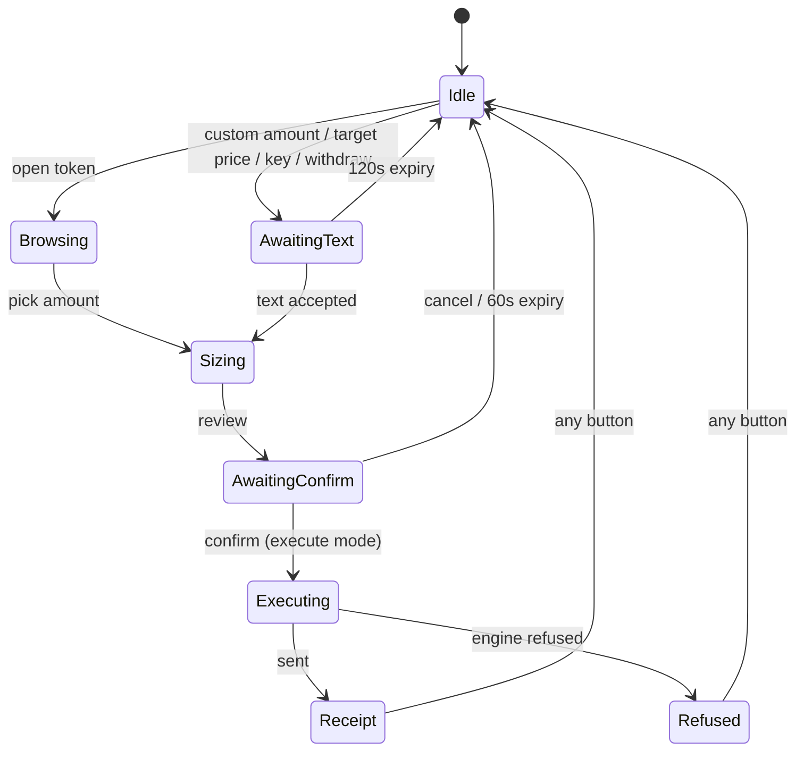

# BaseVantage S2 — Telegram Bot UX Architecture (screen by screen)

This is the complete user-facing architecture of the S2 bot: every screen,
every button, and what each button does. It is the visual companion to
`docs/S2-DESIGN.md` (which defines scope, architecture, and the test list).
Layout notation used below: a card is `text`, buttons are `[Like This]`, and
each screen has a button table with the callback it sends and its effect.

**The four rules every screen obeys** (what makes it "organized" rather than
"a pile of commands"):

1. One card grammar everywhere: header → data lines → verdict/status line →
   buttons. Same spacing, same order, every time.
2. Everything reachable by buttons; commands are shortcuts. Panels update in
   place — the chat history stays clean.
3. Nothing sends without a review card. Every trade shows route, net, min-out
   and safety **before** Confirm.
4. The engine's verdicts are visible. The bot says "no" with one readable
   line and a way forward.

## 0. Navigation map



Every `[← Menu]` button lands on the Main menu from anywhere; every card has
exactly one safe exit.

## 1. `/start` — first contact

```
BaseVantage
Professional trading on Base — from this chat.

⚠️ Trading is risky. You can lose money; tokens can be scams.
This bot checks tax, honeypot and price-impact before every trade and
refuses what it cannot vouch for. It never moves funds on its own.

Your wallet is stored encrypted. We will show the key once — save it.

[Create Wallet]  [Import Wallet]  [Explore First]
```

| Button | Callback | What happens |
| --- | --- | --- |
| Create Wallet | `w:create` | Generates a key, shows the address **and the key exactly once** with a "copy it now" warning, then opens the Main menu. Key is stored encrypted at rest. |
| Import Wallet | `w:import` | Switches the panel to "paste your private key" text-input state (see §8). On success → Main menu. |
| Explore First | `menu` | Main menu with no wallet; buy/sell buttons then lead to a "create or import a wallet first" card. |

Every later `/start` opens the Main menu directly (disclaimer lives in Help).

## 2. Main menu (home base)

```
BaseVantage · menu
wallet  0x71C7…9A3f · 1,204.55 USDC · 0.82 ETH
mode    observe (nothing is sent to chain)
network Base · rpc healthy

[Trade] [Positions] [Orders]
[Watchlist] [Wallet] [Settings]
[Help]
```

| Button | Callback | What happens |
| --- | --- | --- |
| Trade | `nav:trade` | Trade entry screen (§3): instructions + token shortcuts |
| Positions | `nav:pos` | Positions screen (§7) |
| Orders | `nav:ord` | Target orders screen (§9) |
| Watchlist | `nav:wl` | Watchlist screen (§10) |
| Wallet | `nav:wal` | Wallet screen (§11) |
| Settings | `nav:set` | Settings screen (§12) |
| Help | `nav:help` | Flows summary + disclaimer + "invariants tested" line |

The header block (wallet / mode / network) is identical on the menu and is
referenced by every "status" line elsewhere.

## 3. Trade entry

```
BaseVantage · trade
Paste a token contract address (0x…) into the chat,
or open one from your lists.

Recent:
[TOKEN ▸] [DEGEN ▸] [BRETT ▸]
[Watchlist ▸] [← Menu]
```

Typing a CA (the `AwaitingText` detector matches `0x` + 40 hex) opens the
Token card. Token shortcut buttons (`tok:<addr>`) do the same from history,
watchlist or positions.

## 4. Token card (the most important screen)

```
BaseVantage · token
TOKEN (TOKEN) · 0.00000012 USDC · 24h +4.2%
pools   v2 TKN/WETH 1.2M/311 · v3 5bps TVL 842K
dossier sell-tax 0.5% · honeypot no · FoT no
impact  0.05 ETH ≈ 0.31% (cap 1.5%)
verdict allow · sources chain-rpc 3s · mode observe

[Buy 0.05] [Buy 0.1] [Buy 0.25]
[Buy custom ▸] [Sell ▸] [Target ▸]
[⟳ Refresh] [← Menu]
```

| Button | Callback | What happens |
| --- | --- | --- |
| Buy 0.05 / 0.1 / 0.25 | `t:buy:<eth>` | Builds a buy order of that ETH size → Review card (§6). Presets come from Settings. |
| Buy custom ▸ | `t:buyx` | "Type the amount in ETH" text-input state → Review card. |
| Sell ▸ | `t:sell` | Sell sizing (§8): only enabled when the wallet holds the token, else one-line "nothing to sell" card. |
| Target ▸ | `t:tgt` | Target order create (§9). |
| ⟳ Refresh | `tok:<addr>` | Re-renders the same card with fresh quotes/verdicts (in place). |
| ← Menu | `menu` | Main menu. |

The **dossier line is the safety story**: tax, honeypot, FoT straight from
the L4 assess gate. If the engine `Block`s the token, the card renders with a
`verdict BLOCKED — <reason>` line and Buy/Sell/Target are replaced by
`[Why?] [← Menu]`.

## 5. Buy sizing panel

```
BaseVantage · buy TOKEN
spending  0.25 ETH ≈ 642.10 USDC
est. out  638.44 TOKEN (net, after tax+gas)
slippage  1.0% · gas profile: standard

[◂ 0.05] [0.1 ▸] [Custom ▸]
[Review] [← Token] [← Menu]
```

| Button | Callback | What happens |
| --- | --- | --- |
| ◂ / ▸ presets | `t:buy:<eth>` | Re-renders sizing with a different preset (in place). |
| Custom ▸ | `t:buyx` | Typed-amount state → re-render sizing. |
| Review | `ord:review` | Review card (§6). |
| ← Token / ← Menu | back navigation | |

## 6. Review card → Confirm → Receipt (the send pipeline)

```
BaseVantage · REVIEW · sell 15,000 TKN
route   v3 WETH/USDC 5bps -> v2 TKN/WETH
gross   2,412,880.44 USDC
net     2,397,310.02 USDC   (tax 0.5%, gas 0.00042 ETH)
min-out 2,394,100 USDC
        (REFERENCE 2,390,000 · SWAP 2,394,100 -> max)
impact  0.31% <= cap 1.5%
verdict allow · mode observe (nothing will be sent)
confirm window 60s

[Confirm] [Cancel]
```

| Button | Callback | What happens |
| --- | --- | --- |
| Confirm | `ord:ok:<id>` | In **observe**: renders the observe-refusal card (§7). In **execute**: in-place "executing" card → engine `execute` → Receipt. Idempotent: a second tap answers "already sent" and does nothing. After 60s the panel becomes the expired card (`[Order expired] [Start over]`). |
| Cancel | `ord:cancel:<id>` | Order discarded, token card re-rendered. |

**Receipt card:**

```
BaseVantage · receipt · sell 15,000 TKN
filled  2,398,120.55 USDC >= min-out 2,394,100
impact  0.30% · gas 0.00043 ETH
tx      0xabc123…  [View on Basescan]
verdict allow · filled above floor

[Positions] [TOKEN ▸] [← Menu]
```

**Refusal card (engine says no — `Refuse` or `Block`):**

```
BaseVantage · refused
sell 15,000 TKN — not sent
reason  fee-on-transfer token on a multi-hop v3 leg
what now  pick a direct pool route, or wait for S3 routing
verdict refused (your funds were not touched)

[TOKEN ▸] [← Menu]
```

| Button | Callback | Effect |
| --- | --- | --- |
| View on Basescan | external URL button | Opens the tx. |
| Positions / TOKEN ▸ / ← Menu | navigation | |

## 7. Positions

```
BaseVantage · positions
TOKEN   15,000  · 18.42 USDC  · +2.4%  · entry 0.00000011
DEGEN   2,200   · 4.10 USDC   · -0.8%
total   22.52 USDC · wallet 1,204.55 USDC

[⟳ Refresh] [← Menu]
```

Per row: tapping the ticker opens the **position view**:

```
BaseVantage · position TOKEN
held    15,000 TKN · 18.42 USDC (+2.4%)
entry   0.00000011 · now 0.00000012
verdict allow · impact of full exit 0.31%

[Sell 25%] [Sell 50%] [Sell 75%] [Sell 100%]
[Custom ▸] [TOKEN ▸] [← Menu]
```

| Button | Callback | What happens |
| --- | --- | --- |
| Sell 25/50/75/100% | `t:sellp:<pct>` | Builds the sell for that share of holdings → Review card. |
| Custom ▸ | `t:sellx` | Typed amount → Review card. |
| TOKEN ▸ | `tok:<addr>` | Token card. |

## 8. Target orders (the S2 order type)

```
BaseVantage · orders
#1  TOKEN · sell 15,000 · target 0.00000015 · watching
#2  DEGEN · sell all  · target 0.00021 · fired 12m ago
#3  BRETT · sell 500  · target 0.0004 · cancelled

[New Target Order] [⟳ Refresh] [← Menu]
```

Per row: `[#1 ▸]` opens its detail with `[Cancel Order]` (watching only) and
`[TOKEN ▸]`. "New Target Order" flow:

1. Pick the token (positions/watchlist shortcuts or paste CA).
2. Amount: `[All holdings]` or typed amount.
3. Target price: typed (USDC per token) — the only text input in the flow.
4. Review card:

```
BaseVantage · REVIEW · target sell
token    TOKEN · amount 15,000
target   0.00000015 USDC  (= 2.25 USDC total)
min-out  max(anchor floors, target x amount) — never below target
fires    when a live route nets >= min-out
verdict  allow · mode observe (fires as a review prompt)

[Confirm] [Cancel]
```

| Button | Callback | What happens |
| --- | --- | --- |
| New Target Order | `ord:new` | Step 1 of the flow above. |
| #N ▸ | `ord:<id>` | Order detail + Cancel. |
| Cancel Order | `ord:cancel:<id>` | Status → cancelled (L7 rule: the bot never silently removes anything). |

**Firing behaviour (notification):** the watcher (§13) polls the engine; when
the target is met it fires the order with the engine floor rule and posts:

```
BaseVantage · target order filled
TOKEN · sold 15,000 at target 0.00000015
filled  2.261 USDC >= min-out 2.25
tx      0xdef456…  [View on Basescan]
[TOKEN ▸] [Orders] [← Menu]
```

In `observe` mode the "fill" is a prompt instead: `[Review & Confirm] [Cancel]`
— nothing is sent without the human.

## 9. Watchlist

```
BaseVantage · watchlist  7/50
TOKEN  · 0.00000012 · +4.2%   [Open ▸] [Remove]
DEGEN  · 0.000184  · -1.1%   [Open ▸] [Remove]
…

[Enroll token ▸] [⟳ Refresh] [← Menu]
```

Backed by L7: cap 50 with the refusal card past the cap; symbol collisions
refuse with a card naming both addresses; the bot never auto-removes.

## 10. Wallet

```
BaseVantage · wallet
address 0x71C7…9A3f   [Show full]
balance 1,204.55 USDC · 0.82 ETH
stored  encrypted · created 2026-10-06

[Deposit] [Withdraw ▸] [Export Key ⚠]
[Import Key] [New Wallet] [← Menu]
```

| Button | Callback | What happens |
| --- | --- | --- |
| Show full | `w:full` | Full address in a fresh line (copy-friendly). |
| Deposit | `w:dep` | Full address + "send only Base-network assets" note. |
| Withdraw ▸ | `w:wd` | Typed address then typed amount states → review-style confirm card → sends. |
| Export Key ⚠ | `w:exp` | Two-step: warning card `[Yes, I understand] [No]`; only then shows the key once. |
| Import Key | `w:import` | Replaces the wallet after the same warning step. |
| New Wallet | `w:create` | Same as import — behind warning; old key is exported-only-if-asked (never auto-deleted silently). |

## 11. Settings

```
BaseVantage · settings
slippage     1.0%        [◂] [▸]
gas profile  standard    [◂] [▸]
confirm step on          [toggle]
mode         observe     [Switch to execute ⚠]
presets      0.05 / 0.1 / 0.25 ETH   [Edit ▸]

[← Menu]
```

| Button | Callback | What happens |
| --- | --- | --- |
| ◂ / ▸ | `set:slip:±` / `set:gas:±` | Cycles values in place; persisted per chat. |
| toggle | `set:confirm` | When off, Confirm buttons send immediately from the review card (still with the card first). |
| Switch to execute ⚠ | `set:mode` | Opens the execute confirm (below). |
| Edit ▸ | `set:presets` | Typed preset list. |

**Execute-mode confirm (the loudest screen in the bot):**

```
BaseVantage · ⚠ enable execute mode
In execute mode, Confirm buttons send real transactions
with real funds on Base. Checkpoints stay: review card,
min-out floors, safety gates. You can switch back anytime.

[Enable Execute] [Keep Observe]
```

Enabling requires this card **every time** (no "don't ask again").

## 12. Button and state conventions (engineering contract)

- **Callback data** ≤ 64 bytes, namespaced: `nav:*`, `tok:<addr>`, `t:buy:<eth>`,
  `t:sellp:<pct>`, `ord:ok:<id>`, `ord:cancel:<id>`, `w:*`, `set:*`, `menu`.
  Long values (addresses) are truncated to ids resolved through the per-chat
  state, never sent raw.
- **Edit-in-place**: every navigation between panels is `editMessageText`;
  a new message is sent only for: first contact, receipts, refusals that end
  a flow, and notifications.
- **Idempotency**: every callback handler is safe to double-tap; executing
  callbacks carry an order id that resolves exactly once.
- **Timers**: confirm windows (60s) and typed-input states (120s) expire into
  explicit "expired" cards, never silent death.
- **Errors**: engine `Refuse`/`Block` → refusal card; unexpected internal
  errors → one card "something went wrong — nothing was sent, try again"
  with the incident id. A crash never leaves a spinner behind.

## 13. Per-chat state machine



One state per chat; transitions are serialized; illegal callbacks answer
"stale panel" and refresh the current one.

## 14. What is intentionally absent

Sniping, copy trading, DCA, multi-wallet portfolios, referrals, charts,
limit-buy ladders, price alerts. They are not hidden behind menus — they do
not exist in S2. That is the feature discipline that keeps this bot
one-thumb-operable.
